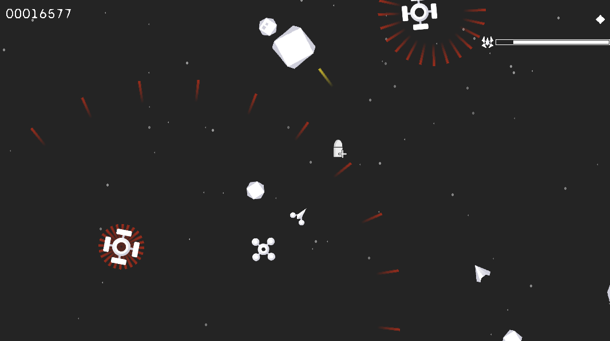

-----------------------------------

# MiniMeteor

### Description

MiniMeteor is a minimalist space shooter game inspired by the classic Asteroids. It’s an endless game with difficulty increasing according to the current score , where you need to destroy asteroids and enemies to score points. 

Originally made for the [Raylib Slo-Jam](https://itch.io/jam/raylib-slo-jam)

### Features

 - The game has powerups, like adding an extra bullet, increasing bullet speed, shields to protect the player, etc.
 - The player has a limited boost that can be used with 'shift'
 - There are two modes for the player: the normal mode; where the movement is locked to the player's front, and the directional ship mode; where the player can freely move around screen with 'wasd'
 - The game has 3 types of enemies: shooter: who periodically shoots at the player, stalker: who constantly follows the player, and pulser: who shoots bullets in the form of a circle.

### Links

 - itch.io Release: [MiniMeteor](https://sham04.itch.io/minimeteor)

Game and UI visual assets were provided by Kenney and modified by me. Checkout Kenney's amazing website! [kenney.nl](kenney.nl)

*Copyright (c) 2023-2024 Sham04s*
